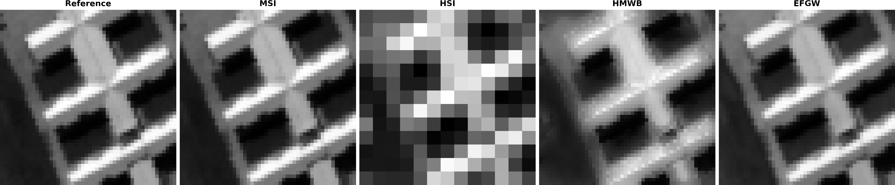
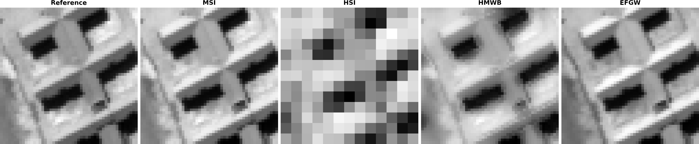
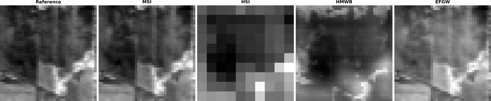
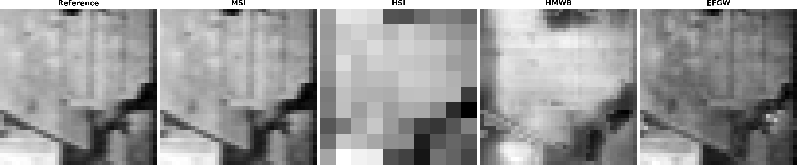
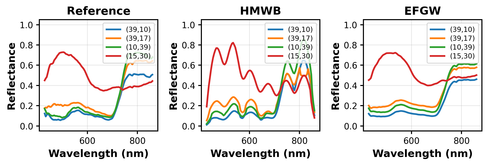
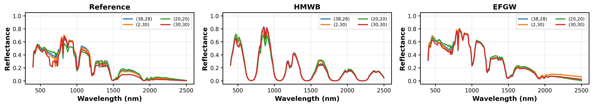

<h1 align="center">Hyperspectral–Multispectral Image Fusion<br>via Fused Gromov-Wasserstein</h1>

<p align="center">
  Official implementation of <b>"Fused Gromov-Wasserstein for Hyperspectral-Multispectral Image Fusion"</b><br>
  A. Guedjali, EH. Djermoune, P. Catala, S. Delchini — <i>submitted to ICASSP 2027</i>
</p>

---

## Table of contents

- [Overview](#overview)
- [Method](#method)
- [Quick start](#quick-start)
- [Datasets](#datasets)
- [Configuration](#configuration)
- [Results](#results)
- [Repository structure](#repository-structure)
- [Evaluation metrics](#evaluation-metrics)
- [Citation](#citation)
- [References](#references)
- [Funding](#funding)
- [Authors](#authors)

---

## Overview

Hyperspectral (HSI) and multispectral (MSI) images are complementary:

| | Spatial resolution | Spectral resolution |
|---|:---:|:---:|
| **HSI** | low | high (100+ bands) |
| **MSI** | high | low (a few bands) |

**Goal:** reconstruct a fused hyperspectral image F that has the **spatial grid of the MSI** and the **spectral content of the HSI**.

**Idea:** an entropic **Fused Gromov-Wasserstein (FGW)** transport plan matches the voxels of the two images, *without requiring a common embedding space and without interpolation*. The plan is then used to transfer the HSI spectra onto the MSI spatial grid.

## Method

The FGW problem combines two terms, balanced by α:

```math
\min_{P \in \Pi(\mu,\nu)} (1-\alpha) \langle C, P \rangle + \alpha \sum_{q,q',r,r'} |A_{qq'} - B_{rr'}|^2 P_{qr} P_{q'r'} - \varepsilon H(P)
```

| Term | Role |
|---|---|
| **C** — spectral cost | Spectral Angle Mapper (SAM) between MSI spectra and HSI spectra projected to the MSI bands |
| **A, B** — structure matrices | Intra-image spatial-spectral distances (spatial coordinates + η-weighted spectral coordinate) |
| **ε** | Entropic regularization (solved with Sinkhorn iterations) |

> **Third-party code.** The entropic FGW solver is **not our own implementation**: it relies on the [POT (Python Optimal Transport)](https://github.com/PythonOT/POT) library ([documentation](https://pythonot.github.io/)), specifically [`ot.gromov.entropic_fused_gromov_wasserstein`](https://pythonot.github.io/_modules/ot/gromov/_bregman.html#entropic_fused_gromov_wasserstein). Our contribution is the application and adaptation of the FGW framework to hyperspectral-multispectral image fusion, including the construction of the cost and structure matrices (C, A, B) for hyperspectral/multispectral images, as well as the reconstruction of the fused image from the resulting transport plan.

**Reconstruction.** The optimal plan is reshaped into a tensor `T[i, k, j, l]` (MSI pixel *i*, MSI band *k*, HSI pixel *j*, HSI band *l*) and marginalized:

```math
F_{il} = \sum_{k=1}^{b_m} \sum_{j=1}^{n_h} T_{ikjl}
```

The result is reshaped to the MSI spatial grid, giving the fused cube of size `l_m × c_m × b_h`.

## Quick start

```bash
git clone https://github.com/guedjaliamel/Hyperspectral-Multispectral-Image-Fusion-via-Fused-Gromov-Wasserstein.git
cd Hyperspectral-Multispectral-Image-Fusion-via-Fused-Gromov-Wasserstein
pip install -r requirements.txt
```

1. Select the dataset at the top of `main.py` (the data are already provided in `data/`):

   ```python
   DATASET = "pavia"          # or "indian_pines"
   ```

2. Run:

   ```bash
   python main.py
   ```

Dataset-specific parameters are selected automatically; **no modification is needed to reproduce the reported experiments.** Outputs (reconstructions, metrics, figures) are written to `results/<dataset>/`.

**Requirements:** NumPy, SciPy, Matplotlib, scikit-image, POT.

## Datasets

Both datasets are already included in the `data/` folder. Original sources are given for reference.

| Dataset | Bands | Extract used | File | Original source |
|---|:---:|:---:|---|---|
| Pavia University | 103 | 50 × 50 | `data/PaviaU.mat` | [Kaggle](https://www.kaggle.com/code/ardaorcun/hyperspectral-paviau?select=PaviaU.mat) |
| Indian Pines | 200 | 40 × 40 | `data/indianpinearray.npy` | [Kaggle](https://www.kaggle.com/datasets/abhijeetgo/indian-pines-hyperspectral-dataset/data?select=indianpinearray.npy) |

**Simulation protocol.** The extract is the reference image. The HSI is obtained by Gaussian low-pass filtering, spatial subsampling and additive Gaussian noise. The MSI (6 bands) is obtained by Gaussian spectral response and additive noise. Both images are normalized to sum to 1.

## Configuration

Shared by both datasets: **α = 0.5**, **ε = 1e-1**.

| Parameter | Pavia University | Indian Pines |
|---|---:|---:|
| MSI bands | 6 | 6 |
| MSI spectral response σ | 5 | 5 |
| HSI Gaussian kernel size | 5 | 5 |
| HSI Gaussian σ | 2 | 2 |
| Spatial downsampling | 4 | 4 |
| FGW ε | 1e-1 | 1e-1 |
| MSI structural parameter η<sub>M</sub> | 3.8893 | 1.5789 |
| HSI structural parameter η<sub>H</sub> | 4.7697 | 3.3002 |

All parameters can be changed in `main.py` for custom experiments.

## Results

FGW is compared with **HMWB** and **B-SCOTT**. **Bold** = best.

### Pavia University

| Method | SAM (rad) ↓ | CC ↑ | R-SNR (dB) ↑ | ERGAS ↓ |
|---|---:|---:|---:|---:|
| **FGW** (ours) | 0.16 | **0.97** | 17.17 | **4.01** |
| B-SCOTT | **0.10** | 0.95 | **17.82** | 4.02 |
| HMWB | 0.25 | 0.90 | 12.61 | 6.52 |

### Indian Pines

| Method | SAM (rad) ↓ | CC ↑ | R-SNR (dB) ↑ | ERGAS ↓ |
|---|---:|---:|---:|---:|
| **FGW** (ours) | **0.07** | **0.99** | **22.96** | **2.06** |
| B-SCOTT | 0.12 | 0.59 | 4.26 | 13.02 |
| HMWB | 0.61 | 0.62 | 2.79 | 18.28 |

### Visual results

Each figure shows, from left to right: reference, MSI, HSI, HMWB, FGW.

#### Pavia University



*Spectral band 25 (MSI band 1)*



*Spectral band 75 (MSI band 4)*

#### Indian Pines



*Spectral band 46 (MSI band 1)*



*Spectral band 118 (MSI band 3)*

### Spectral signatures

Spectra of selected pixels (reference vs. HMWB vs. FGW).

#### Pavia University



#### Indian Pines



## Repository structure

```text
.
├── main.py                 # Entry point: dataset selection, parameters, full pipeline
├── requirements.txt
├── src/
│   ├── data.py             # Loading, simulation of MSI/HSI, normalization
│   ├── fgw.py              # Cost/structure matrices and entropic FGW solver (POT)
│   ├── reconstruction.py   # Transport plan → fused image (marginalization)
│   ├── hmwb.py             # HMWB baseline
│   ├── evaluation.py       # SAM, CC, R-SNR, ERGAS
│   └── visualization.py    # Figures and spectral signatures
├── data/                   # PaviaU.mat, indianpinearray.npy
└── results/
    ├── pavia/              # pavia_efgw.npy, pavia_hmwb.npy, metrics.txt, figures/
    └── indian_pines/       # indian_pines_efgw.npy, indian_pines_hmwb.npy, metrics.txt, figures/
```

The method is called **FGW** in the paper and this README; some output filenames keep the internal `efgw` (entropic FGW) name.
B-SCOTT results come from its original implementation (see [References](#references)) and are not recomputed by `main.py`.

## Evaluation metrics

| Metric | Meaning | Better |
|---|---|:---:|
| **SAM** | Spectral Angle Mapper (rad) | lower |
| **CC** | Cross-correlation | higher |
| **R-SNR** | Reconstruction signal-to-noise ratio (dB) | higher |
| **ERGAS** | Relative dimensionless global synthesis error | lower |

## Citation

The associated paper is currently under review. If you use this code in the meantime, please refer to this repository and to the paper title:

> A. Guedjali, EH. Djermoune, P. Catala and S. Delchini, *Fused Gromov-Wasserstein for Hyperspectral-Multispectral Image Fusion*, submitted to ICASSP 2027.

A BibTeX entry will be added here once the paper is accepted.

## References

- R. Flamary et al., *POT: Python Optimal Transport*, Journal of Machine Learning Research, 2021. Code: [PythonOT/POT](https://github.com/PythonOT/POT)
- T. Vayer et al., *Fused Gromov-Wasserstein distance for structured objects: theoretical foundations and mathematical properties*. [arXiv:1811.02834](https://arxiv.org/abs/1811.02834)
- M. Mifdal et al., *Hyperspectral image fusion using Wasserstein barycenters* (HMWB). [HAL 01620601v1](https://hal.science/hal-01620601)
- C. Prévost, K. Usevich, P. Comon and D. Brie, *Hyperspectral Super-Resolution with Coupled Tucker Approximation: Recoverability and SVD-based Algorithms* (B-SCOTT), IEEE Transactions on Signal Processing, 2020. [HAL hal-01911969](https://hal.science/hal-01911969) — implementation: [cprevost4/HSR_Software](https://github.com/cprevost4/HSR_Software)

## Funding

Supported by the **ANR France 2030 – PEPR Sous-sol, InnovTech project**, grant **ANR-22-EXSS-0006**.

## Authors

| | Affiliation |
|---|---|
| **Amel Guedjali** | Université de Lorraine, CNRS, CRAN, France |
| **El-Hadi Djermoune** | Université de Lorraine, CNRS, CRAN, France |
| **Paul Catala** | Université de Lorraine, CNRS, CRAN, France |
| **Sylvain Delchini** | BRGM – French Geological Survey, Orléans, France |

---

<sub>Copyright © 2026 Amel Guedjali, El-Hadi Djermoune, Paul Catala, Sylvain Delchini.</sub>