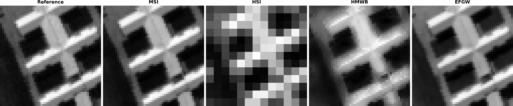
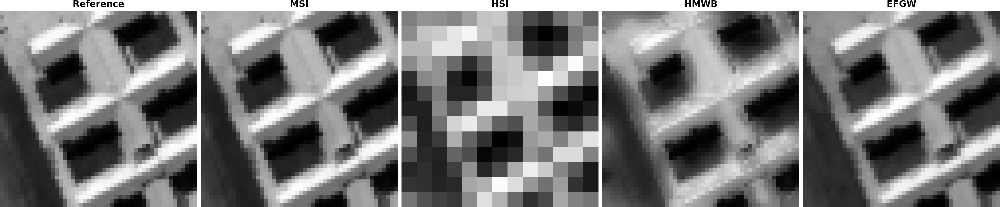
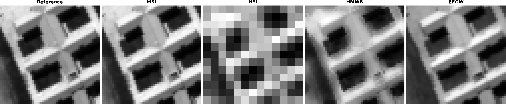
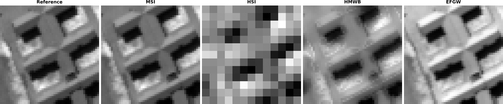
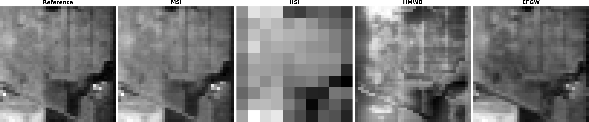
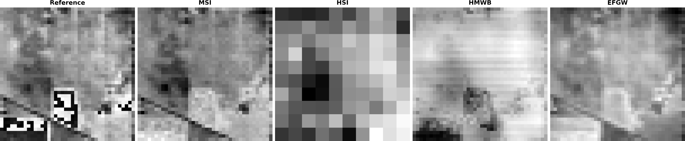
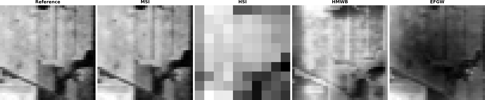
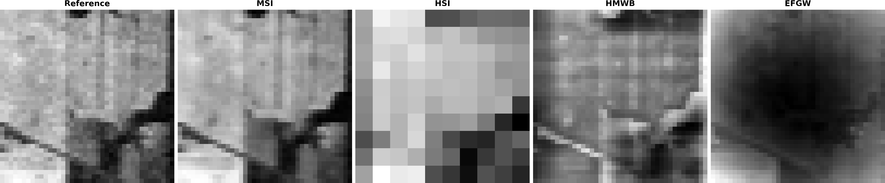

# Hyperspectral-Multispectral Image Fusion via Fused Gromov-Wasserstein

Copyright (c) 2026 Amel Guedjali, El-Hadi Djermoune, Paul Catala, Sylvain Delchini

This repository contains the Python implementation of **hyperspectral-multispectral image fusion using Fused Gromov-Wasserstein (FGW) optimal transport**.

The objective is to reconstruct a high-spatial-resolution hyperspectral image from a high-spatial-resolution multispectral image (MSI) and a low-spatial-resolution hyperspectral image (HSI).

This work is associated with the manuscript:

> A. Guedjali, E.-H. Djermoune, P. Catala, and S. Delchini,
> *Fused Gromov-Wasserstein for Hyperspectral-Multispectral Image Fusion*,
> submitted to ICASSP 2027.

---

## Repository structure

```text
Hyperspectral-Multispectral-Image-Fusion-via-Fused-Gromov-Wasserstein/
│
├── main.py
├── README.md
├── requirements.txt
├── .gitignore
│
├── src/
│   ├── data.py
│   ├── fgw.py
│   ├── reconstruction.py
│   ├── hmwb.py
│   ├── evaluation.py
│   └── visualization.py
│
├── data/
│   ├── PaviaU.mat
│   └── indianpinearray.npy
│
└── results/
    ├── pavia/
    └── indian_pines/
```

---

## Requirements

Python 3 with:

* NumPy
* SciPy
* POT
* Matplotlib
* scikit-image

Install the dependencies:

```bash
pip install -r requirements.txt
```

---

## Datasets

### Pavia University

**Original size:** 610 × 340 × 103

**Experimental patch:** 50 × 50 × 103

Dataset: [Pavia University — Kaggle](https://www.kaggle.com/code/ardaorcun/hyperspectral-paviau?select=PaviaU.mat)

Place the dataset at:

```text
data/PaviaU.mat
```

The MATLAB variable is `paviaU`.

### Indian Pines

**Original size:** 145 × 145 × 200

**Experimental patch:** 40 × 40 × 200

Dataset: [Indian Pines — Kaggle](https://www.kaggle.com/datasets/abhijeetgo/indian-pines-hyperspectral-dataset/data?select=indianpinearray.npy)

Place the dataset at:

```text
data/indianpinearray.npy
```

---

## Method

The proposed method uses **Fused Gromov-Wasserstein (FGW)** optimal transport to combine spectral information and spatial-spectral structure.

The implementation is provided in:

```text
src/fgw.py
```

The fused hyperspectral image is reconstructed from the optimal transport plan using:

```text
src/reconstruction.py
```

### Baselines

**HMWB** is implemented in:

```text
src/hmwb.py
```

**B-SCOTT** is used as an external reference method. Its implementation is not included in this repository.

Original implementation: [HSR_Software](https://github.com/cprevost4/HSR_Software)

---

## Run

Select the dataset in `main.py`:

```python
DATASET = "pavia"
```

or:

```python
DATASET = "indian_pines"
```

Then run:

```bash
python main.py
```

The script automatically:

* loads the dataset;
* extracts the experimental patch;
* generates the MSI and HSI observations;
* computes the FGW transport plan;
* reconstructs the fused HSI;
* runs HMWB;
* computes the evaluation metrics;
* generates the visualizations.

---

# Results

## Pavia University

| Method  | SAM (rad) ↓ |     CC ↑ | R-SNR (dB) ↑ |  ERGAS ↓ |
| :------ | ----------: | -------: | -----------: | -------: |
| FGW     |        0.16 | **0.97** |        17.17 | **4.01** |
| B-SCOTT |    **0.10** |     0.95 |    **17.82** |     4.02 |
| HMWB    |        0.25 |     0.90 |        12.61 |     6.52 |

### Image comparisons











### Spectral signatures

[View Pavia spectral signatures](results/pavia/figures/pavia_signatures.pdf)

---

## Indian Pines

| Method  | SAM (rad) ↓ |     CC ↑ | R-SNR (dB) ↑ |  ERGAS ↓ |
| :------ | ----------: | -------: | -----------: | -------: |
| FGW     |    **0.07** | **0.99** |    **22.96** | **2.06** |
| B-SCOTT |        0.12 |     0.59 |         4.26 |    13.02 |
| HMWB    |        0.61 |     0.62 |         2.79 |    18.28 |

### Image comparisons











### Spectral signatures

[View Indian Pines spectral signatures](results/indian_pines/figures/indian_pines_signatures.pdf)

---

## Evaluation

The reconstructed images are evaluated using:

* **SAM** — Spectral Angle Mapper;
* **CC** — Correlation Coefficient;
* **R-SNR** — Reconstruction Signal-to-Noise Ratio;
* **ERGAS** — Relative Global Dimensional Error.

The implementation is available in:

```text
src/evaluation.py
```

---

## Output

Results are stored in:

```text
results/
├── pavia/
│   ├── pavia_efgw.npy
│   ├── pavia_hmwb.npy
│   ├── metrics.txt
│   └── figures/
│
└── indian_pines/
    ├── indian_pines_efgw.npy
    ├── indian_pines_hmwb.npy
    ├── metrics.txt
    └── figures/
```

The current output filenames contain `efgw` for compatibility with the existing implementation. The proposed method is referred to as **FGW** throughout the documentation and manuscript.

---

## References

### Fused Gromov-Wasserstein

T. Vayer, L. Chapel, R. Flamary, R. Tavenard, and N. Courty.

*Fused Gromov-Wasserstein distance for structured objects: theoretical foundations and mathematical properties.*

[arXiv:1811.02834](https://arxiv.org/abs/1811.02834)

### B-SCOTT

C. Prévost et al.

*Hyperspectral super-resolution with coupled Tucker approximation.*

[HSR_Software](https://github.com/cprevost4/HSR_Software)

### HMWB

Wasserstein barycenter-based hyperspectral-multispectral image fusion.

[HAL: hal-01620601](https://hal.science/hal-01620601v1)

---

## Funding

This work is supported by **ANR France 2030 – PEPR Sous-sol**, through the **InnovTech** project (ANR-22-EXSS-0006).

---

## Authors

**Amel Guedjali** — Université de Lorraine, CNRS, CRAN, France
**El-Hadi Djermoune** — Université de Lorraine, CNRS, CRAN, France
**Paul Catala** — Université de Lorraine, CNRS, CRAN, France
**Sylvain Delchini** — BRGM, Orléans, France
